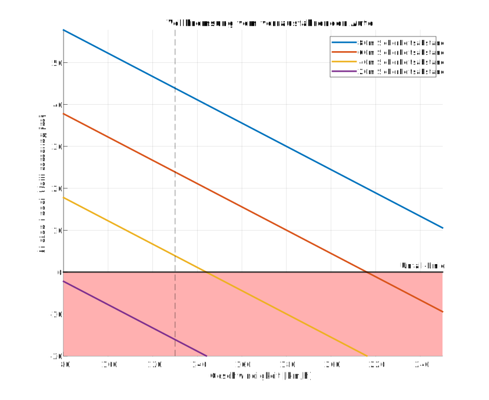

# Sicherheitsabstand-Autobahn
Genug Sicherheitsabstand auf der Autobahn ist sehr wichtig. Folgende Grafik versucht den Abstand bei bestimmten Geschwindigkeiten einzuordnen.

Folgende Grafik zeigt, welcher Sicherheitsabstand nötig ist, wenn zwei Autos die gleiche Geschwindigkeit haben und das vordere Auto eine Vollbremsung macht.

